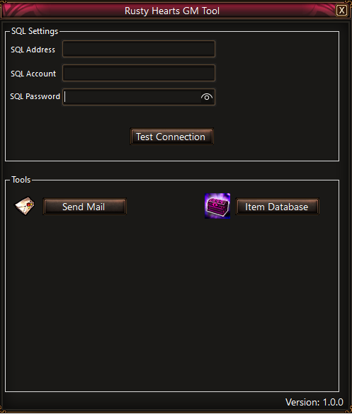
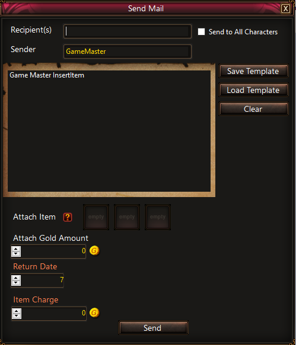
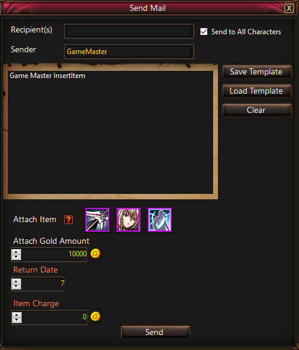
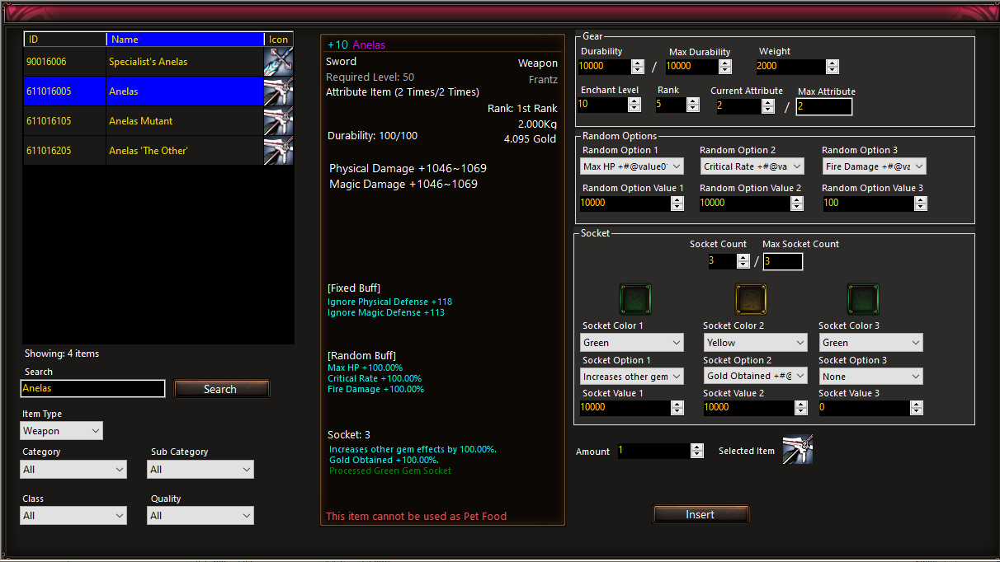

# Rusty Hearts GM TOOL

 <a href="https://github.com/JuniorDark/RustyHearts-GM-Tool/releases">

# Rusty Hearts Game Management Tool

A C# Windows Forms GUI application designed to facilitate GM operations for Rusty Hearts game servers.

## Preview

## Getting Started
To begin using this tool, download the latest release from the [GitHub repository](https://github.com/JuniorDark/RustyHearts-GM-Tool/releases/latest).

## Current Features
Please note that this tool is still in development and more features are planned.

- **Portable Item Database:** View items in a user-friendly datagrid. Selecting an item provides detailed information displayed in a in-game similar tooltip, and items can be sorted using various filters. The search functionality allows find items by name or ID.
- **Send Mail:** Send in-game mail to characters and attach any item with custom stats.
- **Mail Templates:** Save mail configurations to JSON templates for future use. This allows for quick and easy loading of predefined mail settings.

## Setup
The tool relies on a Sqlite database (`gmdb.db`). Follow these steps to set up and generate a new database:

1. Run `CreateGMDatabase` by placing the necessary XLSX table files in the `xlsx` folder. These files are used to create a new database. Move the generated `gmdb.db` to the `Resources` folder in the program directory.

   Required table files in xlsx format:
   - angelaweapon.rh
   - frantzweapon.rh
   - itemcategory.rh
   - itemlist.rh
   - itemlist_string.rh
   - itemlist_armor.rh
   - itemlist_armor_string.rh
   - itemlist_costume.rh
   - itemlist_weapon.rh
   - itemlist_weapon_string.rh
   - itemoptionlist.rh
   - natashaweapon.rh
   - setitem.rh
   - setitem_string.rh
   - tudeweapon.rh

2. Place item icons in the `Resources` folder.

A prebuild database and icons are avaliable on `Resources.rar`

## Prerequisites for Building Locally/Development
The tool is built in .NET 7 and as such, the packages listed below are required to create a local and development build of the tool. Furthermore, it uses many submodules and packages outside of this, which will automatically be loaded when the user sets up a local environment of the application.
* Visual Studio 2022 (Any Edition - 17.6 or later)
* Windows 10 SDK (10.0.19043.0) or Windows 11 SDK (10.0.22000.0) via Visual Studio Installer
* .NET: [.NET Core 7 SDK (7.0.100 or later)](https://dotnet.microsoft.com/en-us/download/dotnet/7.0)

## System Requirements for Ready-to-use build
* OS: Windows 10 1809 Update (build 17763) or later / Windows 11 (Any builds)
* Architecture: x64/AMD64

## License
This project is licensed under the terms found in [`LICENSE-0BSD`](LICENSE).

## Contributing
Contributions from the community are welcome! If you encounter a bug or have a feature request, please submit an issue on GitHub. If you would like to contribute code, please fork the repository and submit a pull request.

## FAQ
* Q: How do I report a bug?
  * A: Please submit an issue on GitHub with a detailed description of the bug and steps to reproduce it.
* Q: How do I request a new feature?
  * A: Please submit an issue on GitHub with a detailed description of the feature and why it would be useful.
* Q: How do I contribute code?
  * A: Please fork the repository, make your changes, and submit a pull request.

## Credits
The following third-party libraries, tools, and resources are used in this project:
* [EPPlus](https://www.nuget.org/packages/EPPlus)
* [Newtonsoft.Json](https://www.nuget.org/packages/Newtonsoft.Json)
* [System.Data.SqlClient](https://www.nuget.org/packages/System.Data.SqlClient)
* [System.Data.SQLite.Core](https://www.nuget.org/packages/System.Data.SQLite.Core)

## Support
If you need help with the tool, please submit an issue on GitHub.